# Algorithm Hub
 Simple Algorithms implemented in C/C++. Experimental in Nature to Test efficiency in writing Code.

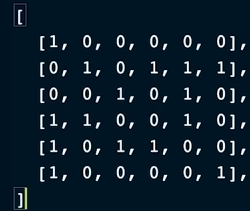

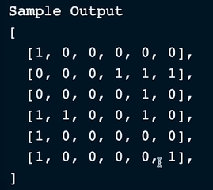

    A) Hash Tables

A hash table is a data structure that maps keys to values using a hash function to compute an index into an array of buckets or slots, from which the desired value can be found. The hash function takes an input (or 'key') and returns an integer, which is used as the index for the array.

1. Why Hash Tables Are Used and Their Time Complexity
   Uses of Hash Tables:

**Fast Data Retrieval**: Hash tables allow for quick data retrieval based on keys. They are used in scenarios where fast lookups, insertions, and deletions are required.
Implementing Dictionaries: Used in the implementation of associative arrays or dictionaries, which store key-value pairs.

**Caching**: Often used in caching mechanisms to store and quickly access frequently used data.
Database Indexing: Employed in databases to quickly locate data without searching every row.

**Time Complexity for Various Operations**:

**Insertion:** Average-case O(1), worst-case O(n) (when many collisions occur)

**Deletion:** Average-case O(1), worst-case O(n) (when many collisions occur)

**Lookup:** Average-case O(1), worst-case O(n) (when many collisions occur)

2. Good-to-Know Information about Hash Tables

        Collision Handling:

**Chaining:** Uses linked lists to store multiple key-value pairs at the same index.
Open Addressing: Resolves collisions by finding another open slot using techniques like linear probing, quadratic probing, or double hashing.
Load Factor:

The **load factor (α)** is defined as the number of elements divided by the number of buckets in the hash table. To maintain efficient operations, the load factor is typically kept below a certain threshold (e.g., 0.75).
When the load factor exceeds this threshold, the hash table is resized, usually doubling its size, and the elements are rehashed into the new table.
Combining Hash Tables:

**Double Hashing:** A collision resolution technique in open addressing that uses a secondary hash function to determine the interval between probes.
Hybrid Structures: Hash tables can be combined with other data structures. For example, a HashMap in Java combines a hash table with a balanced tree (like a Red-Black tree) for buckets that exceed a certain threshold, improving worst-case performance.
Interesting Information:

**Perfect Hashing:** For static sets of keys, perfect hashing provides O(1) worst-case time for lookups by using two levels of hashing.
Bloom Filters: A space-efficient probabilistic data structure that can be used with hash tables to test membership. It can quickly tell if an element is definitely not in the set or possibly in the set, with a certain false positive rate.
Cryptographic Hash Functions: In scenarios requiring high security (e.g., password storage), cryptographic hash functions are used, which are designed to be computationally infeasible to reverse.

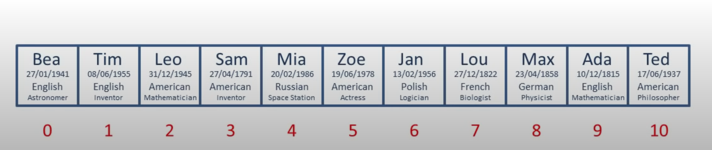

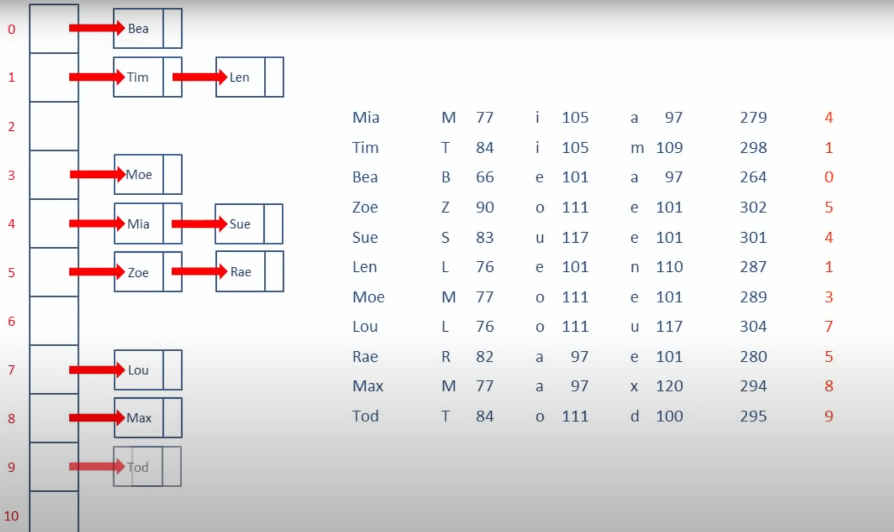
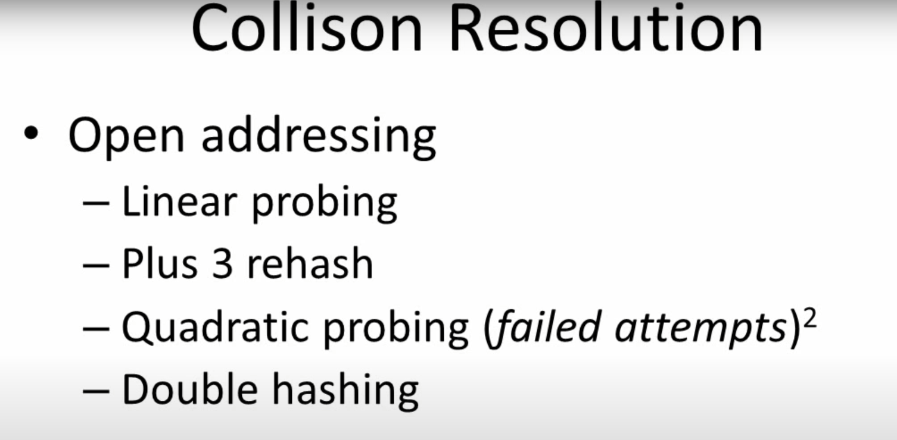
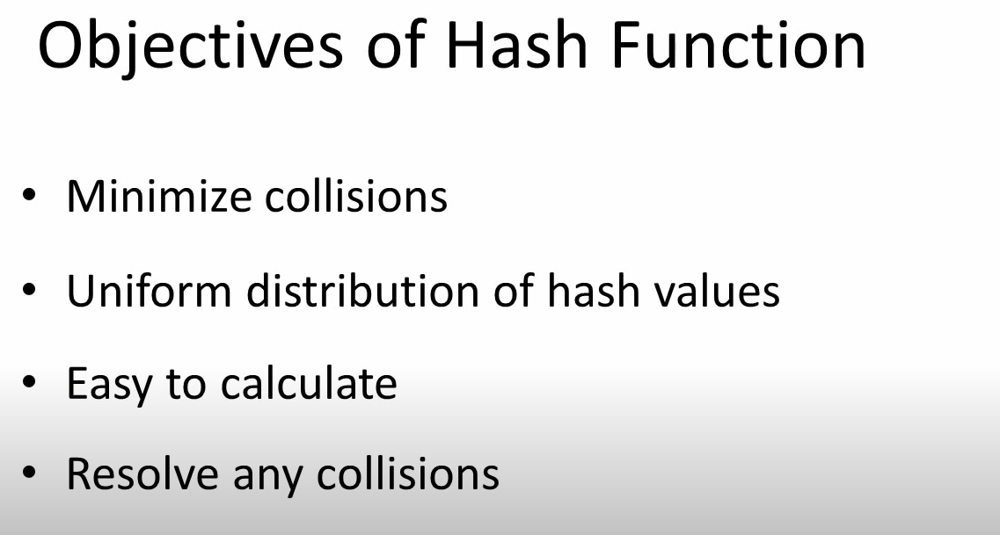
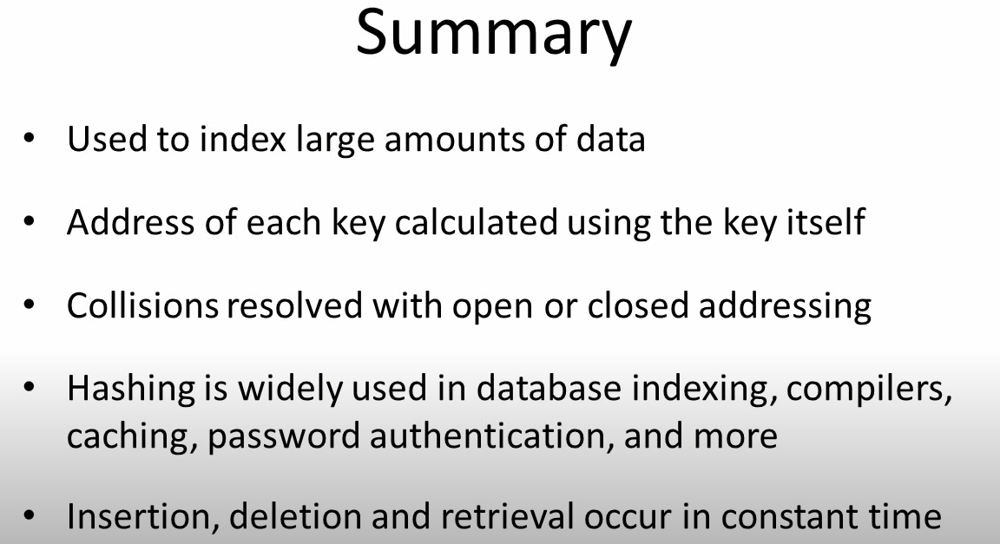

      Graphs

A graph is a data structure that consists of a set of vertices (or nodes) and a set of edges connecting pairs of vertices. Graphs are used to model pairwise relations between objects, making them versatile tools in computer science and various other fields for representing networks, relationships, and structures.

1) Max number of Edges= Vertices(Vertices-1)->Directed and half of it for undirected.
2) Adjacency List is used for sparse graphs and Adjacency Graph is used for dense graph.
3) In a directed graph, strongly connected means all available/max number of networks.

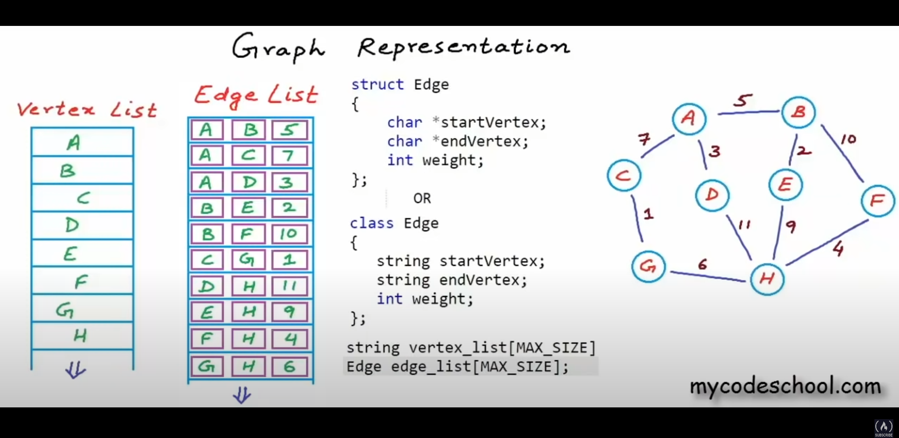

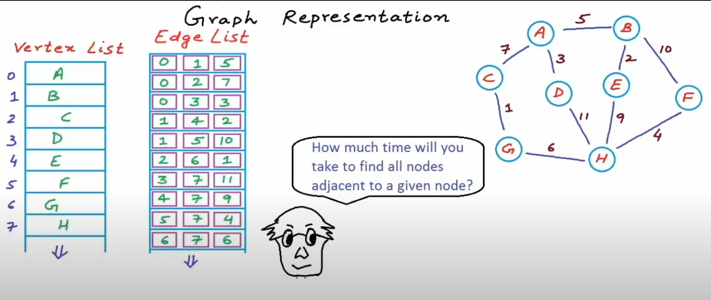

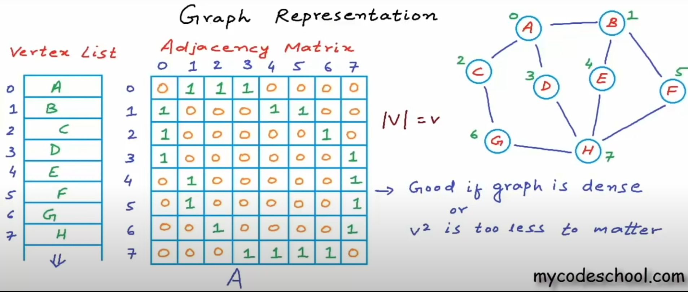

4) Adjacency matrix is good for dense graphs.Adjacency lists is good for sparse graphs.
5) String->Integer

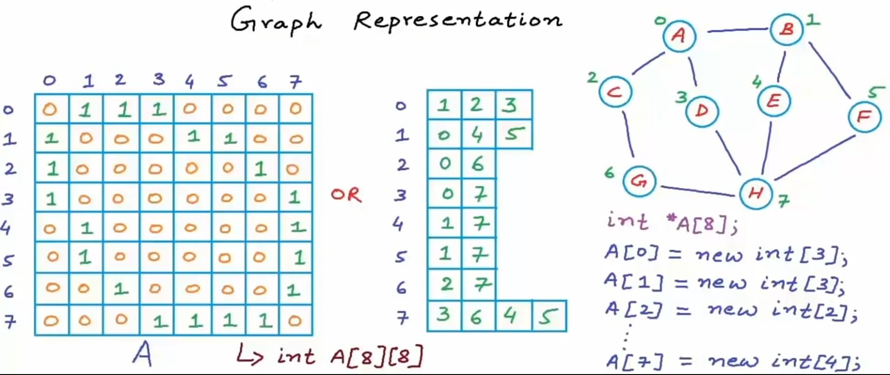

Comparison between matrix and list. If graph is sparse. We often use linked lists for adjacency lists.

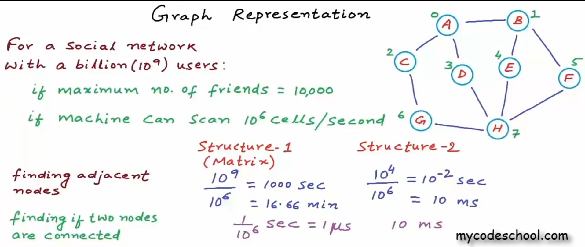

